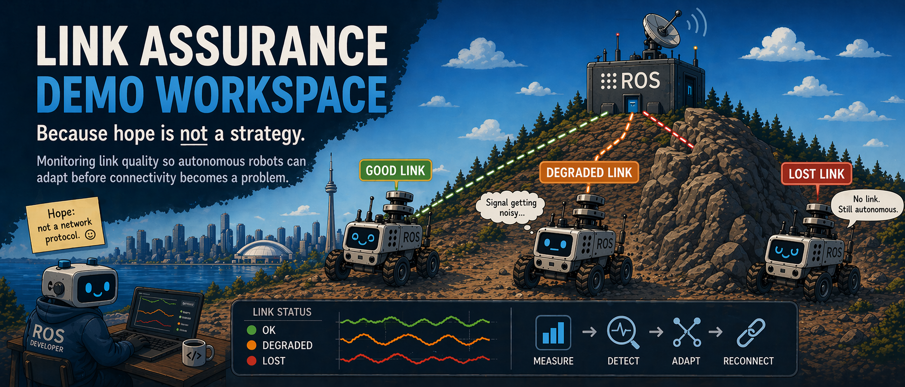
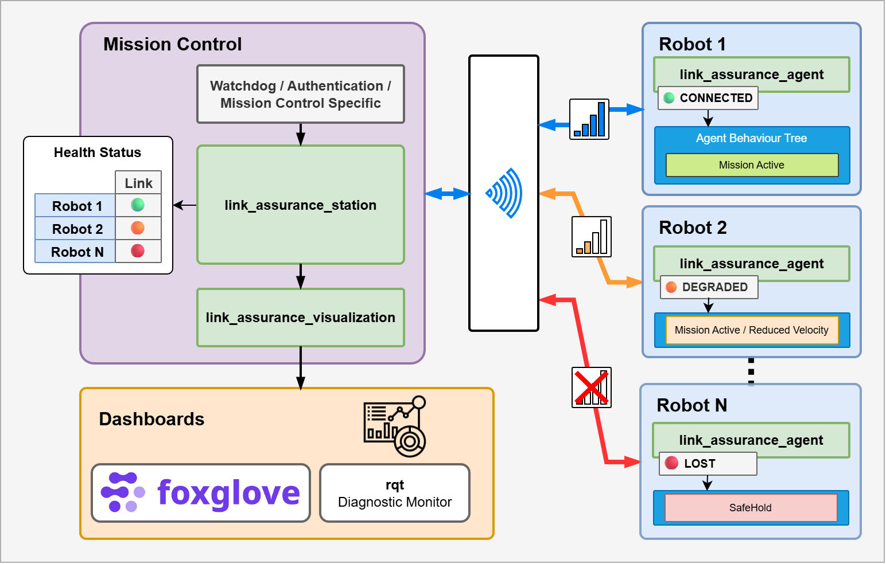
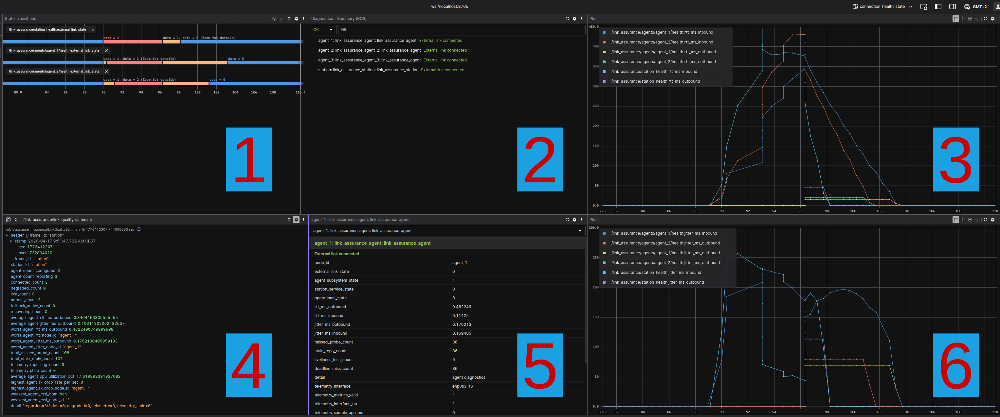

> Header illustration carefully crafted with ChatGPT Image 2.0, coffee, and excessive concern about robot connectivity.
# Link Assurance Demo Workspace

Top-level ROS 2 workspace for the Link Assurance demo system.

This repository provides:

- development environment bootstrap scripts
- dependency retrieval and workspace build scripts
- runtime and fault-injection scripts
- Foxglove assets and workspace-level documentation
- package source under `src/link_assurance`

## Table of Contents

- [Demo Mission Control Architecture in This Workspace](#demo-mission-control-architecture-in-this-workspace)
- [Host Prerequisites](#host-prerequisites)
- [Step-By-Step Setup](#step-by-step-setup)
- [Running the Demo](#running-the-demo)
- [Visualizing the Demo](#visualizing-the-demo)
- [Runtime Fault Injection](#runtime-fault-injection)
- [Key Topics](#key-topics)
- [Troubleshooting](#troubleshooting)
- [Workspace Layout](#workspace-layout)
- [Additional Documentation](#additional-documentation)

## Demo Mission Control Architecture in This Workspace

This workspace turns the concept below into a runnable demo: a mission-control
station supervises a fleet of robots over a potentially unreliable network,
aggregates connectivity health, and exposes operator-facing dashboards.



How this architecture maps to this demo workspace:

1. **Mission control side in the demo**
   - `link_assurance_station` evaluates station-side connectivity state and
     fleet-level quality summary.
   - `link_assurance_visualization` publishes dashboard-friendly summary output.
   - In this workspace, both are launched together by
     `./scripts/run_demo_start.sh`.

2. **Robot side for N agents**
   - Each robot runs one `link_assurance_agent` instance.
   - The demo scales this with `./scripts/run_demo_start.sh --agents <N>`.
   - Robot-specific monitoring can be coupled into the agent path (as illustrated
     for Robot 1) while preserving a common link-assurance contract.

3. **Unreliable network as a first-class concern**
   - Disturbances are intentionally injected with scripts such as
     `run_inject_network.sh`, `run_inject_disconnect.sh`, and campaign tooling.
   - This validates behavior under realistic degradation, not only ideal links.

4. **Three exemplary connection situations**
   - `robot_1`: healthy/connected baseline.
   - `robot_2`: degraded or recovering.
   - `robot_N`: strongly impaired/lost path.
   - The mission-control overview consolidates these into one operator picture.

5. **Two operator visualization paths**
   - **Foxglove** for timeline-centric analysis (state, RTT, jitter, summaries).
   - **rqt Robot Monitor** for diagnostics-centric inspection.

6. **Nav2 / BehaviorTree integration**
   - `link_assurance_bt` exposes existing `LinkHealth` state as BT condition
     nodes and blackboard outputs so that Nav2 behavior trees can gate
     navigation on link connectivity (see `link_assurance_bt/README.md`).

7. **What this workspace enables immediately**
   - Build and run the multi-agent demo.
   - Inject controlled failures.
   - Observe transitions, fallback behavior, and recovery end-to-end.

## Host Prerequisites

- Git
- Visual Studio Code
- VS Code extension: Dev Containers
- Docker Engine (or compatible container runtime)

Recommended host OS:

- Linux (Ubuntu 24.04 tested)

## Step-By-Step Setup

### 1. Clone the workspace repository

```bash
git clone <workspace-repo-url> ws_link_assurance_demo
cd ws_link_assurance_demo
```

### 2. Open the workspace in VS Code

Open the folder in VS Code, then run:

- `Dev Containers: Reopen in Container`

Wait until container initialization completes.

### 3. Bootstrap dependencies and workspace

Inside the devcontainer terminal:

```bash
./scripts/bootstrap.sh
```

Notes:

- In the devcontainer, `bootstrap.sh` intentionally uses `--skip-tests` for a
   faster first setup.
- Run `./scripts/build.sh` afterward when you want a full build + test pass.

If you prefer explicit staged commands:

```bash
./scripts/fetch_dependencies.sh
./scripts/build.sh --skip-tests
```

### 4. Build and verify the workspace

```bash
./scripts/build.sh
```

### 5. Run automated tests

```bash
source /opt/ros/kilted/setup.bash
source install/setup.bash
colcon test --event-handlers console_direct+
colcon test-result --all --verbose
```

## Running the Demo

### 1. Start middleware transport (terminal A)

If you use the default `rmw_zenoh_cpp`, start a router first:

```bash
source /opt/ros/kilted/setup.bash
source install/setup.bash
ros2 run rmw_zenoh_cpp rmw_zenohd
```

If you switch to `rmw_fastrtps_cpp`, a separate router process is not required.

### 2. Start the demo stack (terminal B)

Single agent (default):

```bash
./scripts/run_demo_start.sh
```

Multiple agents:

```bash
./scripts/run_demo_start.sh --agents 3
```

### 3. Optional: BT showcase mode

Launch the standard demo stack with a BT showcase node that implements a
three-mode mission policy based on link health:

| Link state | BT branch | `velocity_scale` |
|---|---|---|
| `CONNECTED` | `MISSION_ACTIVE` | `1.0` |
| `DEGRADED` | `MISSION_ACTIVE_REDUCED_VEL` | `0.5` |
| `LOST` / `STALE` | `SAFE_HOLD` | `0.0` |

```bash
./scripts/run_demo_start.sh --agents 1 --with-bt
```

This publishes JSON status on:

- `/bt_showcase/status`

Example message:

```json
{"bt_branch":"MISSION_ACTIVE","link_state":"CONNECTED","velocity_scale":1.000000}
```

For split mode, you can also co-launch a BT runner per agent:

```bash
./scripts/start_agent_only.sh --node-id agent_1 --station-id station --with-bt
```

That publishes on:

- `/link_assurance/agents/agent_1/bt_showcase/status`

### 4. Advanced: Split Station/Agent Start (Multi-Terminal or Multi-Machine)

Use this mode when station and agents run on different hosts (or separate
terminals/containers).

Station side (terminal B or station machine):

```bash
./scripts/start_station_only.sh --station-id station --agent-ids agent_1,agent_2
```

Agent side for each agent (separate terminals or machines):

```bash
./scripts/start_agent_only.sh --node-id agent_1 --station-id station
./scripts/start_agent_only.sh --node-id agent_2 --station-id station
```

Cross-machine requirements:

- all participants use the same `ROS_DOMAIN_ID`
- all participants use the same `RMW_IMPLEMENTATION` (recommended: `rmw_zenoh_cpp`)
- keep `ROS_LOCALHOST_ONLY=0` for network discovery
- station `--agent-ids` must include all running agent `--node-id` values

### 5. Advanced: Local Multi-Container Emulation

Prerequisite: `docker ps` must work from your shell.
If using the devcontainer, rebuild/reopen once so docker tooling/socket mounts
from `.devcontainer/` are active.

Start one station container and one container per agent:

```bash
./scripts/docker_split_demo_up.sh --agent-ids agent_1,agent_2
```

When using `rmw_zenoh_cpp` (default), this also starts a dedicated router
container (`la_zenoh_router`) for discovery.

This split startup also starts Foxglove bridge by default in the station
container and exposes it at `ws://localhost:8765`.

Useful flags:

- `--no-foxglove` to disable auto-start
- `--foxglove-port <port>` to use a different published port

If the requested Foxglove port is already in use (for example `8765`), the
script automatically retries with the next port(s) and prints the final
websocket URL.

Inject network impairment on one specific split target:

```bash
./scripts/docker_inject_network.sh --target agent_2 --profile bufferbloat --duration 20
./scripts/docker_inject_network.sh --target station --profile outage --duration 10
```

Stop and remove split containers:

```bash
./scripts/docker_split_demo_down.sh
```

## Visualizing the Demo

### Option A: Foxglove

If you use split containers from section 4, Foxglove bridge is already started
inside `la_station` and exposed on `ws://localhost:8765` (or your
`--foxglove-port` value).

If needed, restart the bridge explicitly:

```bash
./scripts/docker_start_foxglove_bridge.sh --station-name la_station --port 8765
```

For non-container runs, start bridge manually (terminal C):

```bash
source /opt/ros/kilted/setup.bash
source install/setup.bash
ros2 run foxglove_bridge foxglove_bridge --ros-args -p port:=8765
```

Then connect Foxglove to:

- `ws://localhost:8765`

Optional layout:

- `config/foxglove/layouts/connection_health_state.json`

#### Example Dashboard: 2 Agents with Bufferbloat Injection

The image below shows the Foxglove dashboard after loading the provided layout
configuration and running the demo with two agents. Around the middle of the
visible time axis, a network disturbance is injected using:

```bash
./scripts/run_inject_network.sh --profile bufferbloat
```



How to read the six panes:

1. **State transitions over time**
   This pane tracks `external_link_state` for station and agents as discrete
   values. In healthy periods, traces stay at `0` (`CONNECTED`). During the
   injection window, traces move to degraded/lost states (`1`/`2`) depending on
   timing and per-node impact. After recovery, traces return to `0`, showing
   convergence back to normal.

2. **Diagnostics summary**
   This is the high-level ROS diagnostics roll-up. It gives an at-a-glance
   status per component (station + each agent) and the current health message,
   for example whether the external link is connected/degraded/lost at the
   selected timestamp. Use this pane as the fast "is the system healthy right
   now?" indicator.

3. **RTT latency (bi-directional) over time**
   This plot shows inbound/outbound RTT-based latency metrics for station and
   agents. Near the fault window, latency rises sharply (large peaks), then
   decays during recovery. The paired inbound/outbound traces help show
   asymmetry and propagation of congestion through both directions.

4. **LinkQualitySummary message inspector**
   This pane displays the full `link_assurance_msgs/msg/LinkQualitySummary`
   payload at the selected time. It exposes fleet-level counters and aggregates
   such as configured/reporting agents, connected/degraded/lost counts,
   worst-node RTT/jitter, telemetry freshness, and aggregate missed/stale
   counters. During disturbance, degraded/lost and timing-related counters rise;
   afterwards, steady-state fields settle back.

5. **Detailed diagnostic drill-down**
   This is the expanded detail view for a selected entry from pane 2. It
   provides concrete fields used for root-cause analysis:
   `external_link_state`, `station_service_state`, RTT/jitter in both
   directions, missed/stale/liveliness/deadline counters, and telemetry
   validity details.
   In practice, this pane answers *why* a component is flagged in diagnostics.

6. **RTT-derived jitter (bi-directional) over time**
   This pane mirrors pane 3 but for jitter. Jitter increases strongly during
   the injected network issue, often with noisy or bursty peaks, then returns
   toward baseline once the fault is removed. Together with pane 3, this
   confirms both delay and delay-variation impact from bufferbloat.

Taken together, the six-pane view provides a full chain from high-level health
state transitions to low-level timing evidence and message-level aggregates.

### Option B: rqt Robot Monitor

```bash
source /opt/ros/kilted/setup.bash
source install/setup.bash
rqt --standalone rqt_robot_monitor
```

## Runtime Fault Injection

Detailed script-driven scenario guidance is available in `docs/scenarios.md`.
Split/container deployment guidance is available in `docs/split_deployment.md`.

### Non-Docker Network Injection (Host or Devcontainer)

Use these scripts when running the demo directly in this workspace (not split
containers).

Safety and interface targeting:

- default target interface is loopback (`lo`)
- this avoids accidentally impairing your host's primary network path
- to target another interface, use `--iface <name>` or `LINK_ASSURANCE_TC_IFACE`
- targeting the default-route interface additionally requires
   `LINK_ASSURANCE_ALLOW_PRIMARY_IFACE=1`

WARNING:

- non-docker `outage` injection can interrupt connectivity for the devcontainer
   and may make your VS Code session temporarily unresponsive when applied to a
   non-loopback or primary interface
- prefer `--iface lo` unless you explicitly need to test host-facing interfaces
- the same caution applies when using
   `LINK_ASSURANCE_DISCONNECT_MODE=tc` in `run_inject_disconnect.sh`

List all supported non-docker network profiles:

```bash
./scripts/run_inject_network.sh --list
```

Available profiles and typical use:

- `latency`: high RTT + jitter
- `wifi_congested`: realistic congested Wi-Fi behavior
- `wifi_edge`: weak edge-of-coverage Wi-Fi behavior
- `burst_loss`: bursty packet loss
- `reordering`: out-of-order delivery bursts
- `bufferbloat`: queue buildup and inflated delay
- `outage`: full packet loss (use with care outside loopback)

Common usage patterns:

```bash
# Run until Ctrl+C, then automatically restore qdisc state
./scripts/run_inject_network.sh --profile wifi_congested

# Time-bounded run (auto-stop)
./scripts/run_inject_network.sh --profile bufferbloat --duration 20

# Delayed start (useful when coordinating with launch timing)
./scripts/run_inject_network.sh --profile latency --start-delay 8 --duration 20

# Target a specific interface explicitly
./scripts/run_inject_network.sh --iface lo --profile reordering --duration 15

# Clear netem state explicitly (if needed)
./scripts/run_inject_network.sh --iface lo --clear
```

Optional environment overrides:

- `LINK_ASSURANCE_FAULT_START_DELAY_S`
- `LINK_ASSURANCE_FAULT_DURATION_S`
- `LINK_ASSURANCE_FAULT_SEED` (deterministic netem randomness)
- profile-specific: `LINK_ASSURANCE_FAULT_DELAY_MS`,
   `LINK_ASSURANCE_FAULT_JITTER_MS`, `LINK_ASSURANCE_FAULT_LOSS_PCT`

Disconnect injection alternatives (non-docker):

```bash
# Default: pause/resume rmw_zenohd process (requires Zenoh router running)
./scripts/run_inject_disconnect.sh

# Time-bounded disconnect pause
LINK_ASSURANCE_FAULT_DURATION_S=10 ./scripts/run_inject_disconnect.sh

# Use tc-based outage mode instead of router pause
LINK_ASSURANCE_DISCONNECT_MODE=tc ./scripts/run_inject_disconnect.sh
```

Notes:

- `router_pause` mode targets `rmw_zenohd` and resumes it automatically on exit
- `tc` mode delegates to `run_inject_network.sh --profile outage`
- all injectors are intended to be started while the demo is already running

Run while the demo is active (non-docker):

```bash
./scripts/run_inject_network.sh --list
./scripts/run_inject_network.sh --profile wifi_congested --duration 20
./scripts/run_inject_disconnect.sh
./scripts/run_inject_station_services.sh
```

For split Docker deployment only:

```bash
./scripts/docker_inject_network.sh --target agent_2 --profile bufferbloat --duration 20
```

Run a fresh full validation campaign (demo start + inject + verify + artifact capture):

```bash
./scripts/run_campaign_validation.sh --topologies 1,2 --attempt-label full
```

Campaign outputs are stored in `log/campaign_<timestamp>/` with `timeline.log`,
`results.tsv`, and per-run evidence directories.

Expected behavior summary:

- network impairment drives `external_link_state` toward `DEGRADED` or `LOST`
- station service injections drive `station_service_state` to `FAILED`
- health and summary topics continue publishing throughout scenario execution

Supported campaign scenarios are:

- `latency`
- `wifi_congested`
- `burst_loss`
- `reordering`
- `bufferbloat`
- `outage`
- `disconnect`
- `station_services`

## Key Topics

- `/link_assurance/station_health`
- `/link_assurance/agents/<agent_id>/health`
- `/link_assurance/health_snapshot`
- `/link_assurance/link_quality_summary`
- `/link_assurance/visualization/summary`

## Troubleshooting

- If no cross-node data flows, verify `rmw_zenohd` is running.
- If netem scripts fail, verify `tc` permissions (`CAP_NET_ADMIN` / sudo policy).
- If topic output appears truncated, use `ros2 topic echo --full-length`.

## Workspace Layout

- `scripts/`: bootstrap, build, run, and injection scripts
- `config/`: reusable configuration and Foxglove assets
- `docs/`: workspace-level docs and operational notes
- `src/link_assurance/`: ROS package repository

## Additional Documentation

- `docs/scenarios.md` (workspace demo scripts and campaign scenarios)
- `docs/testing_strategy.md` (workspace validation and campaign acceptance)
- `docs/split_deployment.md` (split station/agent and container emulation guide)
- `src/link_assurance/README.md` (package repository overview)
- `src/link_assurance/docs/architecture.md` (package architecture)
- `src/link_assurance/docs/scenarios.md` (package-native runtime scenarios)
- `src/link_assurance/docs/testing_strategy.md` (package-level test strategy)

Scope note:

- this workspace README documents bootstrap, launch, fault-injection, and campaign scripts
- package-level implementation and interface details are in `src/link_assurance/`
